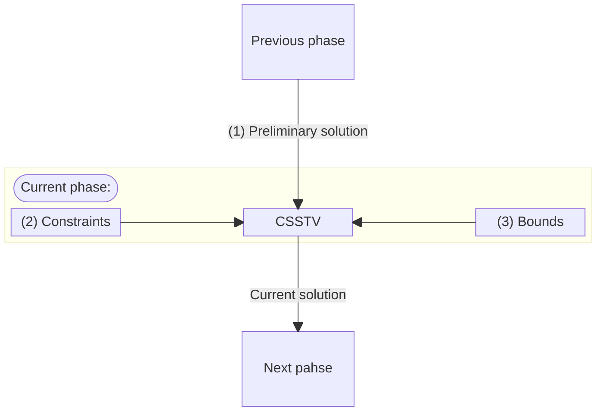
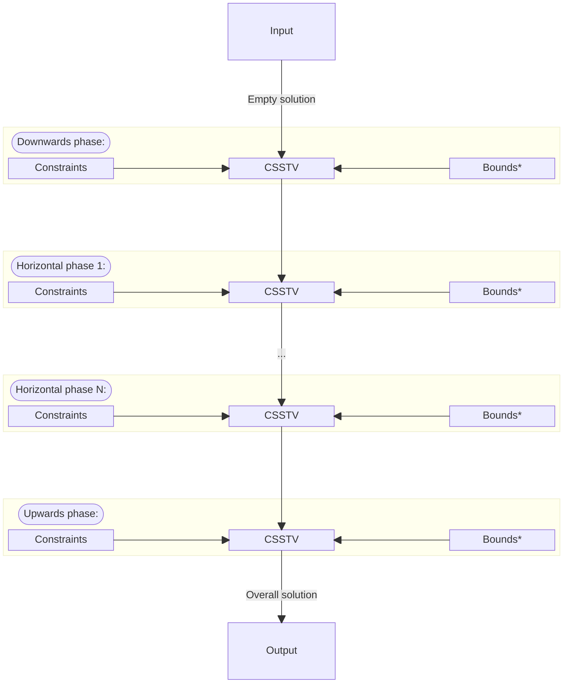
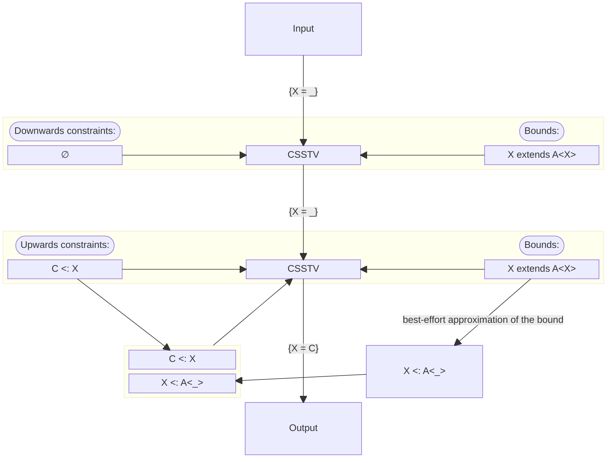
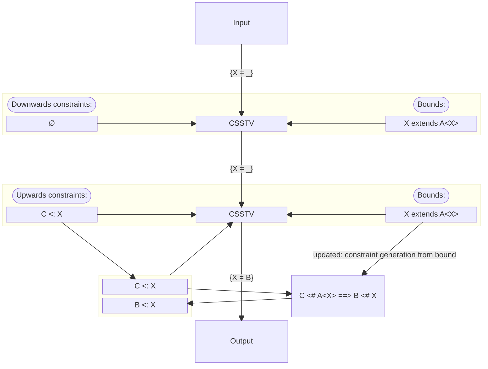

# Inference using bounds

Author: Chloe Stefantsova

Status: Accepted

Version 0.1 (see [CHANGELOG](#CHANGELOG) at end)

Experiment flag: inference-using-bounds

##  Motivating example

The motivating example is discovered and discussed in [#3009][] (Type
inference does not solve some constraints involving
F-bounds). Consider the following code:

```dart
class A<X extends A<X>> {}
class B extends A<B> {}
class C extends B {}

void f<X extends A<X>>(X x) {}

void main() {
  f(B()); // OK.
  f(C()); // Inference fails, compile-time error.
  f<B>(C()); // OK.
}
```

The front ends fail to compile this program, complaining that the
inferred type `C` for `X` doesn't satisfy the bound of `X`.

The expression of interest in the example is `f(C())`. During the
downwards phase of the inference, no constraints are collected because
the type context is empty. During the upwards phase, we build the set
of type constraints `{C <# X}`. Then we generate the overall solution
using the algorithm described in [Constraint solution for a set of
type variables][CSSTV].

Both the constraint set `{C <# X}` and the empty preliminary solution
from the downwards phase `{X = _}` are passed to the algorithm
described in [Constraint solution for a set of type
variables][CSSTV]. The algorithm starts by checking whether the
preliminary solution is known (that is, it doesn't contain the unknown
type `_`), and the check fails. Then the algorithm solves the
constraints for `X`, yielding `X = C` as the solution. Since `C`
doesn't contain `_`, the algorithm checks if `X` has a bound (which it
does: the bound of `X` is `A<X>`), computes the best-effort
approximation of that bound (which is `A<_>`), adds the bound to the
existing set of constraints for `X` (resulting in `{C <# X, X <#
A<_>}`), and tries to solve the updated constraint set for `X`
yielding the same result `X = C`.

Note that adding the best-effort approximation of the bound and
solving the constraint set once again didn't change the outcome. ***In
general, lower bounds are preferred by the type inference, and the
best-effort approximation is added as an upper-bound constraint.***

It is notable that even though the example program contains all the
type information needed to infer `B` as the type parameter, the front
ends following the specification infers `C`, resulting in a
compile-time error during the type checks of the type arguments
against the bounds.

### A more complex example

The following is a more complex example, involving mutually recursive
bounds of two type variables. Currently, it's rejected by the Dart
tools with a compile-time error.

```dart
class A1<X extends A1<X, Y>, Y extends A2<X, Y>> {}
class A2<X extends A1<X, Y>, Y extends A2<X, Y>> {}
class B extends A1<B, B> implements A2<B, B> {}
class C1 extends B {}
class C2 extends B {}

void f<X extends A1<X, Y>, Y extends A2<X, Y>>(X x, Y y) {}

void main() {
  f<B, B>(C1(), C2());
  f(C1(), C2());
  print("Done!");
}
```

In Kotlin a similar program is accepted by the compiler and runs as
expected.

```kotlin
open class A1<out X: A1<X, Y>, out Y: A2<X, Y>>() {}
interface A2<out X: A1<X, Y>, out Y: A2<X, Y>> {}
open class B() : A1<B, B>(), A2<B, B> {}
open class C1() : B() {}
open class C2() : B() {}

fun <X: A1<X, Y>, Y: A2<X, Y>>f(x: X, y: Y) {}

fun main() {
  f<B, B>(C1(), C2());
  f(C1(), C2());
  print("Done!");
}
```

Let's take a look at the source of the described type inference
behaviour in Dart.

## Constraint solution for a set of type variables

Currently, the entire effect the bounds of the type variables may have
on the outcome of the inference is defined by the algorithm of
[constraint solution for a set of type variables][CSSTV] (CSSTV). It
is limited in two ways:

- it is invoked in-between the phases of type inference and doesn't
  collect new type constraints from the context, and
- instead of the actual bound, it uses its "best-effort"
  approximation, eliminating the recursive properties of F-bounded
  type variables.

A convenient way to graphically represent CSSTV is by a square, where
three sides of it take the three inputs relevant to this proposal, and
the fourth side produces the output. The relevant inputs are (1) the
preliminary solution found by the previous phase of the inference, (2)
the constraints collected during the current phase of the inference,
and (3) the bounds of the type variables. The output of the algorithm
is the solution for the current phase, which becomes the preliminary
solution for the next phase.



Since the output from CSSTV for one phase becomes an input for CSSTV
for the next phase, the entire process of type inference can be
thought of as multiple runs of the CSSTV chained together, each taking
the collected constraints from its respective phase.



An important property of CSSTV is the following: if an element of the
preliminary solution from the previous phase is known (that is, it
doesn't contain `_`), it is not changed by the current run of
CSSTV. Effectively, once a known type is produced at the end of any
phase, it becomes "frozen" through the rest of the inference process
and becomes a part of the overall inference result.

The picture below shows the details of the type inference process for
the motivating example using the schematic representation.



## Proposed changes

We propose generating more constraints from existing constraints and
the bound. The original example is solved by this proposal and a few
more beneficial examples are discussed afterwards.

In the motivating example, adding the best-effort bound approximation
didn't affect the result since the set of constraints for `X` already
contained a lower-bound constraint for `X` (`C <# X`), and that
constraint had the priority over the upper-bound "best-effort"
approximation constraint, since type `C` is fully known (i.e. doesn't
contain `_`). In the current proposal ***we aim to derive a
lower-bound constraint by combining the already existing lower-bound
constraint with the actual bound***.

In general, if we have two type constraints of the form `E <: Y` and
`Y <: F`, where `Y` is a type variable and `E` and `F` are type
schemas, it follows that `E <: F` holds if the `E <: Y` and `Y <: F`
hold. So, what if instead of adding the constraint `X <: B'` in step 5
of CSSTV, where `B'` is the best-effort bound approximation, we
generate a new set of constraints, running the subtype constraint
generation algorithm described in [Subtype constraint
generation][subtype-constraint-generation] for `P = C`, `Q = B`, `L =
{..., X, ...}`.

`C` doesn't contain type variables from `L` by construction, and `B`
may contain type variables from `L` (confidently, `X` in case X is
F-bounded, but also any type variables from the same declaration,
regardless of F-boundness of `X`), which makes `C <# B` a valid input
for [Subtype constraint generation][subtype-constraint-generation] and
a good source of additional type information.

The new constraints, generated by [Subtype constraint
generation][subtype-constraint-generation] from `C <# B` are then
added to the overall set of constraints for the current phase of type
inference. Then, the solution for type variable `X` is computed from
the new constraint set, at the end of the updated step 5 of CSSTV.
Note that when `X` isn't F-bounded and its bound doesn't refer to
other type variables from the same declaration, the suggested changes
for step 5 of CSSTV work exactly as the unmodified step 5 of the same
algorithm.

## Re-evaluating the motivating example

Let's see how type inference, updated as proposed, works in the
motivating example.

The downwards phase isn't affected, since it doesn't provide any
contextual type information in this specific example. In the upwards
phase, before step 5 of CSSTV we have the partial solution `X = _`,
the constraint set `{C <: X}`, and the solution of the constraint set
for `X` is `C`, which is known (that is, it doesn't contain `_`).

At step 5 of the modified CSSTV, `C <# X` is a lower-bound constraint
of `X`, so we run [Subtype constraint
generation][subtype-constraint-generation] with `P = C`, `Q = A<X>`
(where `A<X>` is the bound of `X`), `L = {X}`. The next steps are as
follows: `C <# A<X>` → `A<B> <# A<X>` → `B <# X`, which is the new
constraint to add.

We add `B <: X` to the constraint set for `X` (or, equivalently, merge
it with the already merged constraint set for `X`, depending on the
implementation) — it gives us `{C <# X, B <# X}`, and the solution for
`X` becomes `X = B` at the end of step 5 of CSSTV.

`X = B` is "frozen" since B is known, and the overall solution for `X`
is `B`, making the motivating example compile and run without errors.

The picture below shows the details of the updated type inference
process for the example.



## More examples enabled by the current proposal

In addition to the motivating examples, both the original and the more
complex, being unbroken by the current proposal, some cases of non
F-bounded type variables are enabled by it as well.

The following example demonstrates a tempting assumption that doesn't
hold today, but will hold with the proposed update. The developers
might think that they will get the extracted type value for `Y` when
they specify a type value for `X`. We remember similar cases occurring
in practice.

```dart
class A<X extends Iterable<Y>, Y> {
  A(X x);
  Y? y;
}

test() {
  // Developer thinks: A<List<num>, num>.
  A(<num>[])..y = "wrong"; // Today: Ok. With the update: Compile-time error.
}
```

[#3009]: https://github.com/dart-lang/language/issues/3009

[CSSTV]: https://github.com/dart-lang/language/blob/main/resources/type-system/inference.md#constraint-solution-for-a-set-of-type-variables

[subtype-constraint-generation]: https://github.com/dart-lang/language/blob/main/resources/type-system/inference.md#subtype-constraint-generation

## Changelog

### 0.1

-   Initial draft.
