# Cooperative Isolate and Isolate Group Shutdown & Native Resource Disposal

This document outlines a proposed Cooperative Isolate and Isolate Group Shutdown Architecture for the Dart VM and core libraries (`dart:isolate`, `dart:ffi`, and `dart_api.h`).

It directly addresses two immediate crash scenarios caused by background C/C++ worker threads holding outstanding FFI callbacks (`NativeCallable`) inside a live OS process:
* **`Isolate.run` and `Isolate.exit`**: Shutting down a single helper isolate while background native threads are still invoking its FFI callbacks.
* **Hot Restart**: Shutting down an entire `IsolateGroup` while multi-threaded native libraries ([`libcurl`][libcurl], SQLite pool, audio engine) continue streaming data to unmapped FFI trampolines or closed ports.

More broadly, this architecture provides a unified lifecycle safety net for all native C/C++ capabilities (`NativeCallable`, `Dart_Port`, and `PersistentHandle`) during isolate exit, Hot Restart, and in multi-tenant C++ embedder applications.

## 1. Problem Statement: Unilateral Shutdown

### Problem 1: FFI Callbacks + Isolate.exit
When a short-lived helper isolate spawned via `Isolate.run` initiates an async native task (such as a C HTTP stream or database query), the native library stores a `NativeCallable` pointer. If the helper calls `Isolate.exit()` before that native stream is cancelled and drained, the callback trampoline is unmapped while the background C thread is still executing.

### Problem 2: FFI Callbacks + Hot Restart & Background Reclaim
When a developer initiates a Hot Restart (or when the OS/engine reclaims background isolates), the VM shuts down the active `IsolateGroup` while native worker threads continue streaming data to unmapped FFI trampolines or closed ports. For example, in [`package:cupertino_http`][http-issue-1894], iOS `NSURLSession` background threads invoking unmapped `NativeCallable.listener` blocks after isolate teardown trigger `dart::Assert::Fail` and crash the app (`SIGABRT`).

### Problem 3: External & Persistent Resource Leaks
When an isolate, isolate group, or the entire OS process (`exit(0)` / `SIGTERM`) terminates unilaterally without running cleanup hooks, external and persistent resources are leaked: on-disk lock files (`app.lock`, `sqlite.db-wal`) and database connections remain abandoned on disk or in memory (for instance, causing database locking failures across Hot Restarts in [`package:drift`][drift-issue-3558]), temporary file directories are not removed, and remote database or network connections ([`libpq`][libpq] / [`libcurl`][libcurl]) never receive clean disconnect frames.

### Unilateral Shutdown Consequences
In the current VM architecture, when an isolate or isolate group is unilaterally shut down (`Dart_ShutdownIsolate()`, `Isolate.exit()`, or during Hot Restart):
1. Receive ports (`Dart_Port`) are immediately closed and FFI callback trampolines (`NativeCallable`) are unmapped during low-level shutdown.
2. Surviving background native worker threads inside the C library (`libcurl`, SQLite pool, audio engine) continue streaming data and attempt to invoke the unmapped FFI callback or post to dead ports.
3. This causes immediate segmentation faults (undefined behavior), blocks native code indefinitely (deadlocks), or permanently leaks native resources that are never signaled to be freed.

## 2. Proposed Solution: Cooperative Async Shutdown

To make isolate and isolate group shutdown safe, we need a cooperative exit mechanism to coordinate asynchronous shutdown across boundaries, and we must error on synchronous exit whenever native code still holds on to an isolate or isolate group.

This cooperative mechanism directly mirrors POSIX signal handling (`SIGTERM` / `SIGINT`), Java's [`Runtime.addShutdownHook()`][java-shutdown-hook], and .NET's [`IHost.StopAsync()`][dotnet-ihost-stopasync]. Just as those mechanisms provide a process with a cooperative grace period to flush buffers, delete disk lock files, and stop async reactors before the OS terminates the process, `Dart_RequestIsolateGroupShutdown` provides an `IsolateGroup` with a cooperative grace period to run `.dispose()` across its registered resources before the VM initiates low-level destruction.

### Part 1: Cooperative Shutdown Request
* The C embedder (`dart_api.h`) gains an asynchronous shutdown request method taking a completion callback and context pointer:
  ```c
  typedef void (*Dart_IsolateGroupShutdownCompletionCallback)(void* user_data,
                                                              const char* error);

  DART_EXPORT void Dart_RequestIsolateGroupShutdown(
      Dart_IsolateGroup group,
      Dart_IsolateGroupShutdownCompletionCallback callback,
      void* user_data);
  ```
* Instead of instantly executing low-level destruction, this initiates cooperative shutdown across all isolates in the target group. Once all registered `.dispose()` callbacks have settled and low-level group destruction (`IsolateGroup::Shutdown()`) has safely torn down the heap, the VM invokes `callback(user_data, NULL)` on a native C thread (or passes an error string if teardown failed or timed out). Crucially, by notifying C via a function pointer after memory reclamation rather than returning a `Dart_Handle` (`Future<void>`), the API prevents C embedders from holding dangling handles to a destroyed `IsolateGroup` heap.

### Part 2: Dart Disposable Registry
* The `dart:isolate` library exposes a registration API where applications and helper isolates can register `Disposable` components that must be cleanly shut down when cooperative group shutdown or Hot Restart is requested:
  ```dart
  Isolate.registerShutdownDisposable(myService);
  // and when no longer needed or disposed manually:
  Isolate.unregisterShutdownDisposable(myService);
  ```

This `dart:isolate` registry directly fulfills and generalizes the long-requested Flutter Hot Restart lifecycle hooks ([flutter/flutter#75528][flutter-issue-75528]) (`onHotRestart` / `dispose` callbacks) across all plugins and native resources. The Flutter framework itself can register as a root `Disposable` via this hook and expose higher-level, framework-specific disposal registration to plugins and widgets.

### Part 3: Automatic Teardown
* **Cooperative Execution**: When cooperative group shutdown (`Dart_RequestIsolateGroupShutdown`) is initiated (such as during Hot Restart), the runtime coordinates shutdown across isolates based on their configured `IsolateShutdownRole`:
  1. **`detached` (Autonomous Services)**: The runtime sends a `requestShutdown()` signal directly to their event loops to invoke `.dispose()` on all locally registered `Disposable`s and awaits their completion (default on `Isolate.spawn`).
  2. **`owned` (Attached Workers)**: The runtime does not signal these isolates directly. Instead, they remain running so their spawning/owning parent isolate can coordinate their teardown during the parent's own `.dispose()` execution. Therefore, whenever an isolate spawns a helper with `shutdownRole: IsolateShutdownRole.owned`, the spawning isolate should wrap the helper's `Isolate` handle inside a local `Disposable` object (e.g., `WorkerClient implements Disposable`) and register that wrapper via `Isolate.registerShutdownDisposable(...)`. The wrapper's `.dispose()` method must signal the helper to shut down (`child.requestShutdown()`) and `await` the helper's `onExit` event (`Isolate.addOnExitListener`) across an exit receive port before completing.
* **Safe Low-Level Destruction**: Once all `.dispose()` futures across `detached` isolates settle and `owned` worker isolates exit, the underlying native C libraries have drained their background threads and closed their external handles (resulting in zero active `preventShutdown` references), allowing low-level isolate destruction to proceed without leaks or crashes.
* **Outermost Registration**: To prevent out-of-order teardown where a child handle is disposed while its enclosing parent is still using it, only outermost `Disposable` instances (`App` in the main isolate, or `DbService` in a detached service isolate) should register via `Isolate.registerShutdownDisposable(...)`. The registered outermost wrapper then cascades `.dispose()` inward to its child dependencies in top-down order (`await client.dispose()`).

### Part 4: Strict Lifecycle Enforcement
* **Synchronous Exit Fails Fast**: Both `Isolate.exit()` and `Dart_ShutdownIsolate()` fail immediately (`StateError` or `Dart_ERR_ACTIVE_RESOURCES`) if:
  1. Any external reference (`ReceivePort`, `NativeCallable`, or `PersistentHandle`) currently exists on the isolate with `preventShutdown = true`.
  2. Any registered `Disposable` currently remains unclosed inside the isolate's `Isolate.registerShutdownDisposable` registry (`.dispose()` has not been executed and settled or unregistered).

> **Note**: `preventShutdown` and strict synchronous exit enforcement are not strictly necessary for the core cooperative shutdown proposal (`Disposable` + `registerShutdownDisposable` + `Dart_RequestIsolateGroupShutdown`). The cooperative shutdown flow awaits `.dispose()` futures directly without needing `preventShutdown` flags. However, `preventShutdown` and sync exit checks make finding bugs much easier by acting as an immediate guardrail (`StateError`) when a developer accidentally attempts a premature synchronous `Isolate.exit()` while FFI trampolines or ports are still open.

To govern external references and ports safely without interfering with normal event-loop completion, external references expose two orthogonal flags:

| Reference Flag | Governed Lifecycle Mechanism | Semantics |
| :--- | :--- | :--- |
| `keepIsolateAlive` (`bool`) | Natural Event-Loop Exit (`Isolate::Run()`) | Prevents the Dart event loop from naturally completing when idle. |
| `preventShutdown` (`bool`) | Explicit Exit Enforcement (`Isolate.exit` or `Dart_ShutdownIsolate`) | Implies `keepIsolateAlive = true`. Prevents explicit or immediate low-level exit while active native threads hold the external reference. |

Strict synchronous exit enforcement only verifies the *current* isolate's root shutdown registry. If a helper isolate (`Isolate.run` / `Isolate.spawn`) allocates a native resource whose `Disposable` wrapper or `preventShutdown` handle is indirectly owned and registered by a parent wrapper in an *outer/owning isolate*, strict enforcement on the helper isolate will fail to trigger when the helper exits synchronously (`Isolate.exit()`). Furthermore, because `Isolate.kill()` completely bypasses `.dispose()` execution across all isolates, it is a strict programmer error for a helper isolate that manages native resources or FFI callbacks to leak its `Isolate` object (and thus the capability to terminate it via `kill()`) to any external or third-party code.

## 3. End-to-End Use Cases

### Use Case 1: Helper Isolate with HTTP Client
To perform non-blocking HTTP requests without stuttering main application threads, an isolate-offloading Dart HTTP client (`IsolateHttpClient`) spawns a background helper isolate via `Isolate.spawn(..., errorsAreFatal: false, shutdownRole: IsolateShutdownRole.owned)`. Inside the helper isolate, a concrete client (`HttpClient`—such as [`package:cupertino_http`][package-cupertino-http] on iOS/macOS or [`package:cronet_http`][package-cronet-http] on Android) interfaces with a native C/ObjC/JNI HTTP library (`NativeHttpClient`) that executes requests on a dedicated background thread pool (`WorkerThread`) and streams incoming response bytes back to the helper isolate via an FFI `NativeCallable.listener` or `ReceivePort` (preventing fatal `SIGABRT` / `dart::Assert::Fail` crashes upon isolate teardown like [`package:cupertino_http` issue #1894][http-issue-1894]).

The following diagram illustrates the strict single-ownership hierarchy extending from the isolate runtime registry through the main isolate heap, across the isolate boundary, and into native C heap memory:

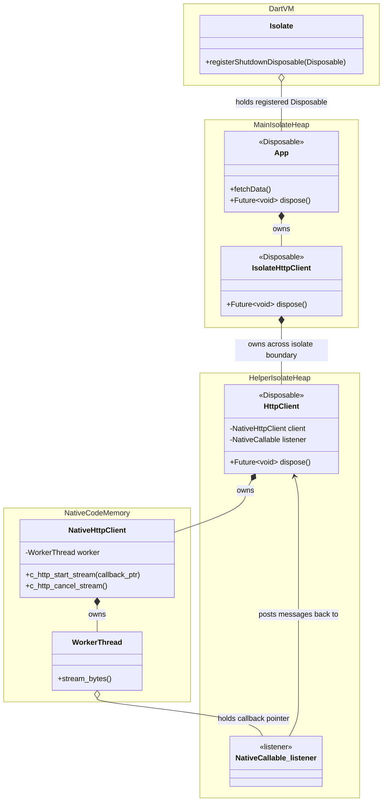

#### Sequence Diagram 1: Programmer Error — Premature Exit
**Scenario**: The main application (`App`) registers `IsolateHttpClient` with the isolate shutdown registry (`Isolate.registerShutdownDisposable`) and starts an HTTP request worker via `Isolate.spawn(..., errorsAreFatal: false, shutdownRole: IsolateShutdownRole.owned)`. Inside the helper isolate, the programmer calls `Isolate.exit(...)` directly before cancelling the native HTTP client (`HttpClient.dispose()` is omitted). Strict lifecycle enforcement converts what used to crash the VM with a segmentation fault when using `NativeCallable`s (or, when using ports, drop messages and permanently leak the native HTTP client in the background) into an immediate Dart exception thrown across the isolate boundary.

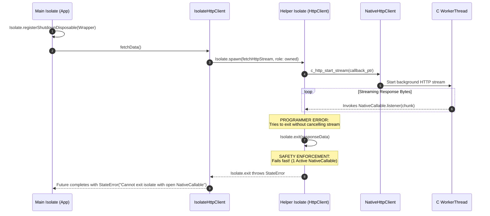

#### Sequence Diagram 2: Cooperative Shutdown — Disposing Before Exit
**Scenario**: The helper isolate explicitly cancels/disposes the native HTTP client (`HttpClient.dispose()`) before invoking `Isolate.exit(...)`.

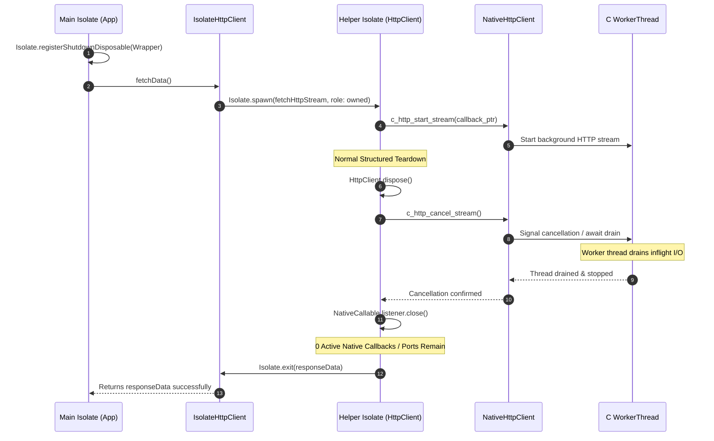

#### Sequence Diagram 3: Hot Restart — Top-Down Group Shutdown
**Scenario**: While the HTTP request is actively streaming across the helper isolate, the developer initiates a Hot Restart from the IDE. The VM dispatches `Dart_RequestIsolateGroupShutdown`, and the runtime automatically awaits `.dispose()` across all registered root `Disposable` instances.

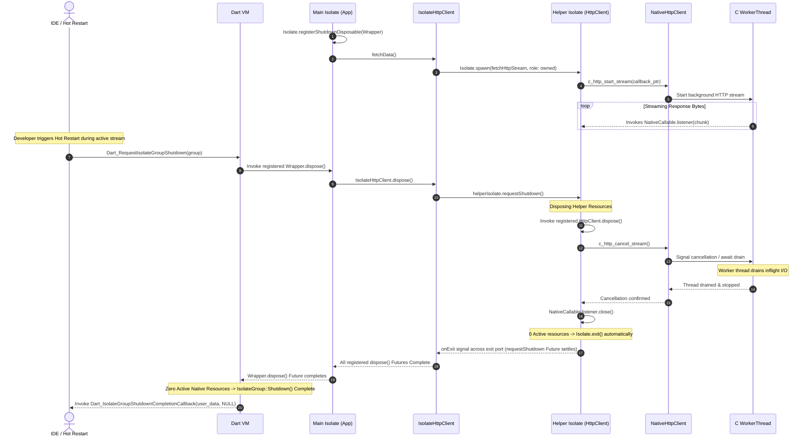

### Use Case 2: Detached Background Isolate
An application spawns a long-running, process-detached background service isolate (`Isolate.spawn(...)`)—such as an embedded local HTTP/metrics server—where nothing in the main isolate holds a reference to the helper isolate.

Because the detached helper isolate registers its root service object (`WebServerService`) directly in its own isolate-local runtime registry (`Isolate.registerShutdownDisposable(WebServerService)`), the main application does not need to wire custom RPC shutdown messages. When a Hot Restart occurs, the VM concurrently awaits the registered `Disposable.dispose()` futures across every live isolate in the group.

#### Ownership Hierarchy
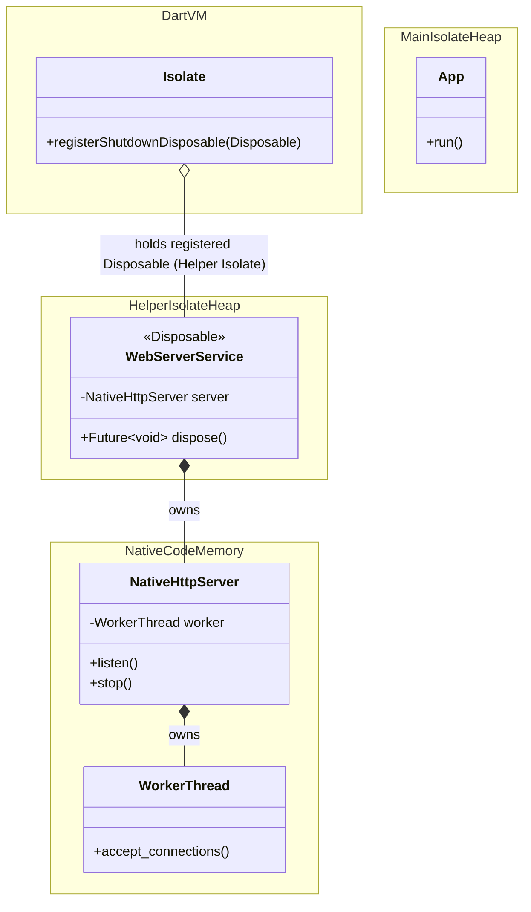

#### Sequence Diagram 1: Hot Restart Sequence
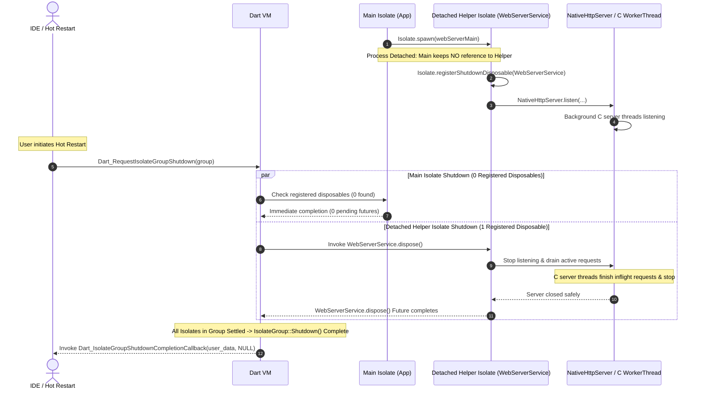

### Use Case 3: Leaf Singleton Resource (SQLite)
When working with exclusive leaf singleton resources—such as a database client (`DatabaseConnection` in [`package:sqlite3`][package-sqlite3] wrapping a native `sqlite3*` file handle)—an application may combine cooperative `Disposable` registration with a `NativeFinalizer` fallback (`sqlite3_close_v2`).

If the application drops all strong references to `DatabaseConnection` right before a Hot Restart occurs, the weak reference in the runtime shutdown registry (`WeakReference<Disposable>`) is cleared upon GC. Consequently, `.dispose()` is skipped during the cooperative phase of `Dart_RequestIsolateGroupShutdown`. However, because `sqlite3*` is a leaf resource (its C finalizer closes the database handle synchronously without calling back into Dart), `RunAndCleanupFinalizersOnShutdown()` safely invokes the `NativeFinalizer` during low-level isolate teardown.

Because `Dart_RequestIsolateGroupShutdown(group)` only completes its returned `Future<void>` after low-level teardown (`IsolateGroup::Shutdown()`) has fully finished, the exclusive SQLite file lock is guaranteed to be released before the IDE or embedder launches the new Hot Restart isolate and attempts to open the database again (resolving long-standing database locking issues during Hot Restart such as [`package:drift` issue #3558][drift-issue-3558]).

#### Sequence Diagram 1: Hot Restart Sequence
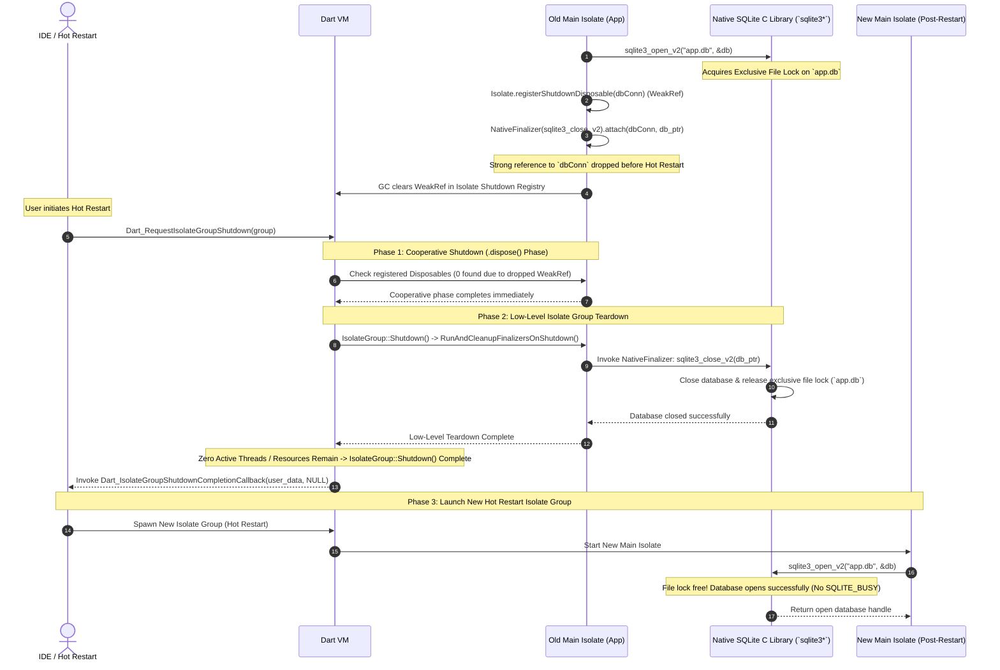

### Use Case 4: Shared Ownership of a Database Isolate (DAG Topology)
In many real-world architectures, resource ownership is not a simple parent-child tree but a Directed Acyclic Graph (DAG). For example, a primary application isolate (`Isolate A` / `AppClientA`) may spawn two worker isolates: a background sync/cache isolate (`Isolate B` / `SyncClientB`) and a database pool helper isolate (`Isolate C` / `DbPoolWorker`). Both `Isolate A` and `Isolate B` need to run concurrent queries against `Isolate C`.

Although both `Isolate A` and `Isolate B` share concurrent access to `Isolate C` via a **Reference-Counted Lease Manager** (`DbWorkerLease`), there is still a single primary spawner/owner (`Isolate A`) that holds the underlying `Isolate` handles (`syncIsolate` and `dbIsolate` with `IsolateShutdownRole.owned`).

The lease count ($N$) on `Isolate C` prevents premature termination while either client is active. When cooperative shutdown (`AppClientA.dispose()`) occurs on `Isolate A`:
1. `Isolate A` sends cooperative shutdown requests (`requestShutdown()`) to **both** child isolates (`syncIsolate` and `dbIsolate`) and releases its local lease (`-1` sent across `SendPort` to `Isolate C`, decrementing $N: 2 \rightarrow 1$).
2. When `dbIsolate` (`DbPoolWorker`) receives `requestShutdown()`, its `.dispose()` method checks the active lease count ($N$). Because $N > 0$ (the background sync worker `Isolate B` has not finished yet), `DbPoolWorker.dispose()` **does not immediately close the database**. Instead, it suspends (`await _zeroLeasesCompleter.future`) until all active leases have been terminated ($N == 0$).
3. Meanwhile, `Isolate B` (`SyncClientB`) receives its `requestShutdown()` signal, completes its in-flight transactions, executes `SyncClientB.dispose()` (`-1` sent across `SendPort` to `Isolate C`, decrementing $N \rightarrow 0$), and exits.
4. The moment $N$ hits $0$, `DbPoolWorker`'s suspended `.dispose()` method resumes, closes the C database pool (`sqlite3_close_v2`), and automatically exits (`Isolate.exit()`), sending the exit completion over the exit `SendPort` / `requestShutdown()` `Future` back to `Isolate A`, allowing `AppClientA.dispose()` to settle.

#### Ownership Hierarchy (DAG Topology with Primary Owner)
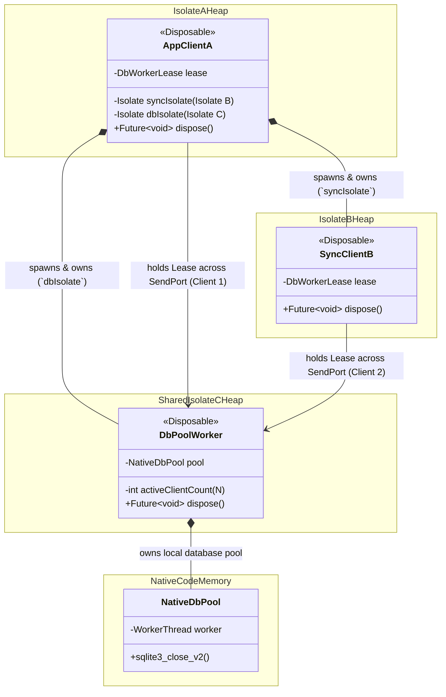

#### Sequence Diagram 1: Parallel Shutdown Request with Lease Deferral
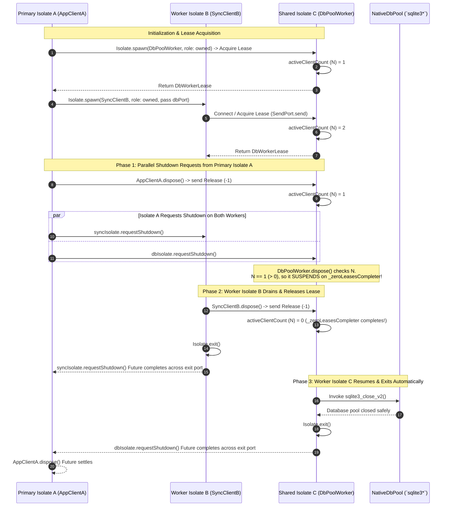

### Use Case 5: Single Helper Isolate with Multiple Native Callbacks (Multi-Library Topology)
In advanced native integrations, a single helper isolate may maintain status metrics or process real-time streams that are fed and polled by **multiple independent native C libraries**. For example, in a media application, the main Dart isolate (`MainIsolate`) loads two distinct C engines: a real-time audio mixing library (`libaudio.so`) and a diagnostic telemetry/tracing library (`libtelemetry.so`).

To prevent audio streaming and telemetry polling from stuttering the main UI thread, `MainIsolate` spawns a single background helper isolate (`AudioTelemetryWorker`). Inside `AudioTelemetryWorker`, two separate FFI callbacks (`NativeCallable.listener`) are allocated and passed across C boundaries: `audioCallback` (passed to `libaudio`) and `telemetryCallback` (passed to `libtelemetry`). Both callbacks default to `preventShutdown = true` and `keepIsolateAlive = true`.

Because the two C libraries (`AudioEngine` and `TelemetryEngine`) are owned inside the main Dart isolate (`MainIsolate`), `MainIsolate` coordinates the structured shutdown. When `App.dispose()` runs on `MainIsolate`, it `await`s the asynchronous shutdown of both native C engines first. As those C threads stop streaming and unmap their targets, they post high-priority teardown confirmations back to `AudioTelemetryWorker`. Once both `audioCallback` and `telemetryCallback` are closed ($0$ remaining `preventShutdown` / `keepIsolateAlive` references), `AudioTelemetryWorker` automatically exits itself (`Isolate.exit()`).

#### Sequence Diagram 1: Multi-Library FFI Callback Teardown
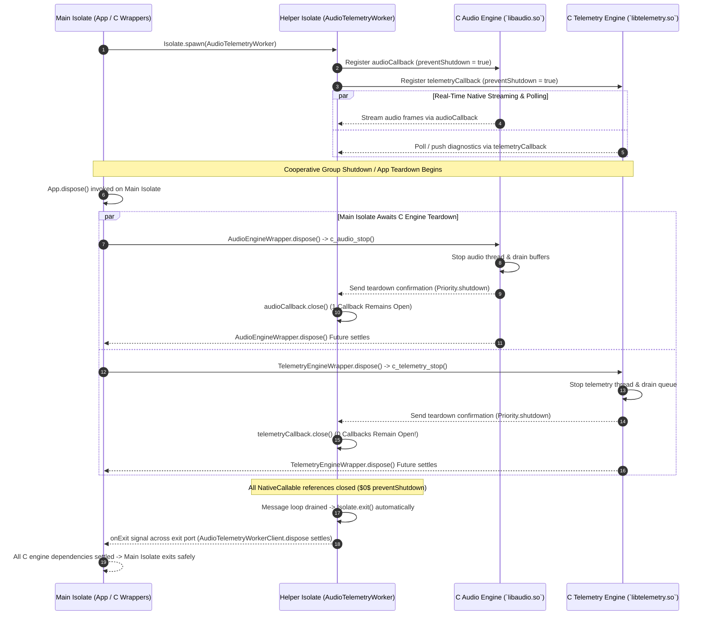

## 4. Abnormal Isolate Termination

When an isolate terminates outside the cooperative asynchronous shutdown flow (`Isolate.requestShutdown()` / `Dart_RequestIsolateGroupShutdown`) or explicit synchronous completion (`Isolate.exit()`), the runtime faces a fundamental conflict between reclaiming Dart heap memory and preserving native C/C++ memory invariants.

This section covers the three primary modes of abnormal termination and defines their architectural requirements, observability mechanisms, and API deprecations.

### A. Isolate Kills (`Isolate.kill()` / `Dart_KillIsolate()`)

When an external actor explicitly kills an isolate using `Isolate.kill()` (whether with `priority: immediate` or `priority: beforeNextEvent`) or `Dart_KillIsolate(isolate)`:

1. **Bypassing Disposables and Async Event Queue**: Whether `priority` is set to `immediate` (which interrupts the mutator thread midway through execution via `UnwindError`) or `beforeNextEvent` (which intercepts the event loop right after the current synchronous event ends), the kill operation does not drain the isolate's async event queue and will not invoke `.dispose()` across registered `Disposable` instances. Any pending messages, timers, suspended `await` tasks, and cooperative shutdown hooks (`requestShutdown()`) are discarded immediately when the message loop terminates.
2. **Inconsistent Native State**: Because `.dispose()` is bypassed and the target mutator thread may have been interrupted midway through modifying shared memory or FFI data structures, native C/C++ handles, database locks (`SQLITE_BUSY` or `SQLITE_LOCKED`), network sockets, or external hardware state may be permanently left in an inconsistent, leaked, or corrupted state.
3. **Proposed Deprecation and Removal**: Following the architectural precedent of other major language runtimes—such as Java (which deprecated and removed [`Thread.stop()`][java-thread-stop]) and .NET (which removed [`Thread.Abort()`][dotnet-thread-abort] and [`AppDomain.Unload()`][dotnet-appdomain-unload] in .NET Core / .NET 5+ due to unrecoverable native state corruption)—we propose deprecating and eventually removing `Isolate.kill()` (both `immediate` and `beforeNextEvent` priorities) and `Dart_KillIsolate()`. Applications, IDEs, and C embedders must transition exclusively to cooperative asynchronous shutdown (`Isolate.requestShutdown()` or `Dart_RequestIsolateGroupShutdown`) or structured worker completion. Notably, the Flutter engine does not use `Dart_KillIsolate()` during Hot Restart or lifecycle teardown, making this deprecation and removal path safe and straightforward for the primary Dart embedder.

### B. Out-of-Memory (OOM) and Heap Exhaustion

When an isolate exhausts its Dart heap (`out_of_memory()`), memory allocation fails and the Dart mutator stack unwinds via `UnwindError`.

1. **Unsafe Cooperative Cleanup**: Because the Dart heap is exhausted, executing user-defined Dart `.dispose()` methods on the OOM isolate is unsafe and doomed to fail with secondary OOM cascades when `.dispose()` attempts to allocate `Future`s, closures, or messages. Therefore, cooperative `.dispose()` execution must be bypassed during OOM across every `Disposable` in the isolate.
2. **Why Embedder Observability Is Insufficient**: Merely having the VM check for unclosed `preventShutdown = true` resources (`NativeCallable.listener`) during OOM to tell the embedder if the shutdown was "unclean" is insufficient. A `Disposable` might wrap a native `sqlite3*` or file handle without holding any `preventShutdown` references into Dart. Because `.dispose()` is bypassed on OOM, that database handle or file lock is left open in C memory even if `preventShutdown` count is zero.
3. **Embedder Responsibility (Universal Fatal Abort)**: Because any Dart-heap OOM bypasses `.dispose()` across all registered `Disposable` instances and may leave arbitrary unmanaged C/C++ handles (`sqlite3*`, `libcurl` threads) in a leaked or corrupted state, embedders must universally treat any Dart-heap OOM as an unclean, fatal engine error and abort the host process (`exit(1)` or `abort()`) rather than attempting to recover or continue running in a degraded state.

### C. `errorsAreFatal: true` and `Isolate.run`

By default, helper isolates spawned via `Isolate.spawn(..., errorsAreFatal: true)` and `Isolate.run(...)` unilaterally terminate their message loop and jump directly to `Dart_ShutdownIsolate()` upon encountering any uncaught exception.

1. **The Disposable Bypass Problem**: When `errorsAreFatal == true` terminates an isolate due to an uncaught exception, invoking `.dispose()` on registered `Disposable` instances is completely bypassed. Furthermore, cooperative `.dispose()` cannot be safely executed upon an uncaught exception because user `.dispose()` code would execute against a half-broken, inconsistent, or corrupted Dart heap state.
2. **Embedder Responsibility (Unrecoverable Engine Error)**: Aligned with other major programming languages (.NET Core [`FailFast`][dotnet-failfast], Java [`System.exit(1)`][java-system-exit], Go [`exit(2)`][go-exit], and Rust [`abort()`][rust-abort]), because `errorsAreFatal == true` skips `.dispose()` and leaves underlying C/C++ worker threads (`libcurl`, `sqlite3*`) uncleaned and in an unknown or corrupted state in native memory, embedders should treat any `errorsAreFatal: true` uncaught exception (just like an OOM) as an unrecoverable, fatal engine error and abort the host process (`exit(1)` or `abort()`) rather than attempting to recover or continue running in a degraded state.
3. **Programmer Error (`Isolate.run` vs `Isolate.spawn`)**: For a helper isolate that manages native resources whose lifecycle is wrapped inside a `Disposable` on another/parent isolate, it is a strict programmer error to use `Isolate.run()`, because `Isolate.run()` hardcodes and implies `errorsAreFatal: true`. When `errorsAreFatal: true` encounters an error inside the helper, the helper instantly destroys itself without executing `.dispose()` or allowing the parent to coordinate teardown.
4. **The Correct Pattern (`Isolate.spawn` + Disposable Wrapping)**: Instead, programmers spawning helper isolates that manage native resources must use `Isolate.spawn(..., errorsAreFatal: false, shutdownRole: IsolateShutdownRole.owned)` and wrap the spawned `Isolate` object inside a `Disposable` class on the parent isolate. When an error occurs or when cooperative shutdown (`Disposable.dispose()`) is triggered on the parent wrapper, the parent explicitly sends a shutdown request (`child.requestShutdown()`) to the helper isolate and awaits the helper's `onExit` signal across an exit `ReceivePort` (`addOnExitListener`). This structured wrapping guarantees that the parent isolate does not settle its `.dispose()` until the helper has cleanly executed its own `Disposable` methods and fully terminated.

## 5. Priority Queuing for Shutdown, FFI Callbacks, and Native Ports

When cooperative shutdown (`Isolate.requestShutdown()` or `Dart_RequestIsolateGroupShutdown`) begins, or when `Disposable.dispose()` cancels a native C thread pool (`libcurl` / SQLite), the background worker threads must post their "teardown complete" confirmation messages back to the Dart isolate via an FFI callback (`NativeCallable.listener`) or a C port (`Dart_PostCObject`).

If these shutdown commands (`SendPort.send`) and native C confirmation messages were enqueued at standard priority (`Message::kNormalPriority`), they would get trapped behind thousands of normal data events inside the isolate's `MessageHandler` (`queue_`), causing the cooperative `.dispose()` `await` to hang or time out under heavy load.

### Cross-Language Precedents
Major actor and event-loop runtimes separate administrative/shutdown control messages from high-volume user data:
* **Akka and Apache Pekko**: Distinct [System Mailboxes][pekko-system-messages] process `Terminate` signals ahead of normal user messages.
* **Node.js (`libuv`)**: A dedicated [Close Callbacks (`uv_close`) phase][libuv-close-callbacks] ensures native C++ teardown confirmations bypass standard I/O polling.
* **Orleans and Java**: Orleans virtual actors use high-priority [Control Messages][orleans-overview], while Java executors use [`PriorityBlockingQueue`][java-priority-blocking-queue] to dequeue `ShutdownTask`s and JNI callbacks first.

### Proposed VM & Core Library Extensions
The Dart C++ VM already possesses the architectural foundation (`queue_` for normal messages vs. `oob_queue_` / `before_events = true` for high-priority control messages). We propose exposing this capability across all three messaging boundaries with an explicit shutdown priority level so that developers do not misuse high-priority queues for normal operational tasks:
1. `SendPort.send(message, {priority: MessagePriority.shutdown})` (`dart:isolate`): For parent isolates coordinating with `owned` helpers.
2. `NativeCallable<T>.listener(..., {priority: MessagePriority.shutdown})` (`dart:ffi`): For C worker threads confirming callback teardown.
3. `Dart_PostCObjectPriority(port_id, message, Dart_MessagePriority_Shutdown)` (`dart_api.h`): For C libraries posting port-based close confirmations.

Furthermore, during cooperative `.dispose()` execution (`ShutdownZone`), async yield points (`scheduleMicrotask` / `await`) should prioritize shutdown-related microtasks (`_nextPriorityMicrotask`), provided the C++ `MessageHandler` is allowed to interleave and deliver incoming high-priority native C confirmation messages (`ReceivePort` / `NativeCallable`) so that `.dispose()` futures never deadlock.

## 6. Ownership Transferral and Lease Handoffs

When passing or transferring ownership of a `Disposable` resource (or an `owned` helper isolate) across boundary lines, the architectural mechanism depends on two critical factors: whether the object is **isolate-local vs. transferable across isolates**, and whether the boundary handoff is **asynchronous vs. synchronous**.

### A. Single-Isolate Leases vs. Transferable Native-Backed Leases

1. **Single-Isolate Leases (`Dart Heap Counter`)**: If the lease manager object lives in a single isolate (e.g., `DbPoolWorker` in Use Case 4, where multiple client isolates communicate with a central database isolate via `SendPort` RPCs), the lease count ($N$) is a simple mutable integer (`int activeClientCount`) stored directly on the database isolate's Dart heap.
2. **Transferable Leases (`Native-Backed Shared Memory + NativeFinalizer`)**: If the `Disposable` or `Lease` object *itself* needs to be transferable between multiple Dart isolates (`SendPort.send()`), it cannot store its lease count ($N$) or liveness flag (`isDisposing`) inside mutable Dart fields, because sending across a `SendPort` copies Dart objects into independent isolate heaps.
   Therefore, a transferable `Disposable` / `Lease` must store no mutable Dart fields and instead be backed by a small control block in **native C/C++ memory (`malloc` / `Pointer<NativeLeaseControlBlock>`)**.
   Crucially, **the native memory backing the lease object is distinct from the unmanaged resource being disposed**:
   * **`Disposable.dispose()`**: Executes cooperative resource cleanup (such as calling `sqlite3_close_v2()` or `childIsolate.requestShutdown()`) or decrements the active lease count ($N \rightarrow N-1$).
   * **`NativeFinalizer` (Backing Memory Cleanup)**: The native memory block (`Pointer<NativeLeaseControlBlock>`) **survives `.dispose()`** and is only freed when every Dart isolate referencing it has dropped its wrapper and GC executes the attached `NativeFinalizer` (`free` / `delete`).

### B. Synchronous vs. Asynchronous Handoff Boundaries

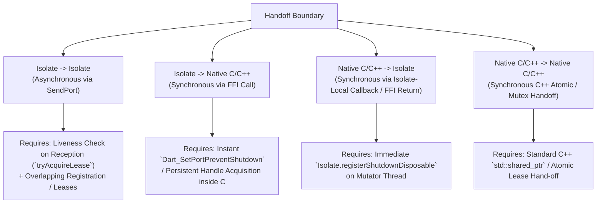

#### 1. Isolate $\rightarrow$ Isolate (Asynchronous via `SendPort`)
Because message transit across ports (`SendPort.send`) is asynchronous, there is an in-flight window where neither the sending nor the receiving isolate actively holds the object in its local `registerShutdownDisposable` registry. If a Hot Restart or `Dart_RequestIsolateGroupShutdown` occurs during transit (or if high-priority shutdown messages bypass normal messages sitting in `queue_`), an in-flight handoff can cause leaks or priority inversion.

To safely transfer or share a resource across an asynchronous `SendPort` boundary:
* **Liveness Check on Reception (`tryAcquireLease`)**: When the receiving isolate dequeues `Pointer<NativeLeaseControlBlock>` from its normal message queue, before wrapping it in a local `Disposable` and registering it, it must atomically verify via FFI that cooperative shutdown has not initiated on the block (`!block->is_shutting_down`). If `is_shutting_down == true`, the receiver aborts the handoff (`tryAcquireLease()` returns `false`) and drops the pointer without registering or using the dying resource.
* **Overlapping Registration / Lease Handshake**: If transferring a single-owner resource ($N=1$), the sender keeps its registration active (`registerShutdownDisposable`) until the receiver dequeues the handle, registers its local wrapper, and sends an ACK (`ownership acquired`). If sharing via a reference-counted transferable lease, the sender issues a new lease token ($N \rightarrow N+1$) before sending, ensuring $N \ge 1$ across transit. Both `.dispose()` and `requestShutdown()` must be strictly **idempotent**.

#### 2. Isolate $\rightarrow$ Native C/C++ (Synchronous via FFI Call)
When a Dart isolate transfers ownership of a worker isolate or resource to a native C/C++ embedder or plugin via a synchronous FFI call (`c_take_worker_ownership(port_id)`), the handoff is **synchronous**. Because the C/C++ function executes synchronously on the mutator thread's call stack, there is zero in-flight message queue gap.
The C/C++ embedder immediately acquires its safety nets before returning from the FFI call:
1. `Dart_SetPortPreventShutdown(port_id, true)` (or `Dart_NewPersistentHandle_PreventShutdown`), ensuring the worker cannot exit prematurely while C++ owns it.
2. `Dart_NewNativePort(...)` attached via `isolate.addOnExitListener()`, guaranteeing that C++ receives the exact `onExit` event when the worker terminates.

#### 3. Native C/C++ $\rightarrow$ Isolate (Synchronous via Isolate-Local Callback or Sync FFI Return)
When a C/C++ embedder hands off ownership of a background worker or resource to a Dart isolate, the handoff is also **synchronous** if delivered directly to the target isolate's mutator thread via:
* **The Return Value of a Synchronous FFI Call**: E.g., `final workerToken = c_spawn_and_handoff_worker();`.
* **An Isolate-Local FFI Callback (`NativeCallable.isolateLocal`)**: A synchronous callback executing directly on the target isolate's mutator thread.
Because the handle arrives synchronously on the active mutator thread without sitting in an unread message queue, the Dart isolate immediately wraps the pointer (`Pointer<NativeLeaseControlBlock>` or `SendPort`) in a local `Disposable` object and registers it (`Isolate.registerShutdownDisposable(wrapper)`) right on the call stack before any asynchronous yield point (`await`) occurs.

#### 4. Native C/C++ $\rightarrow$ Native C/C++ (Synchronous C/C++ Handoff)
Inside the native C/C++ embedder or plugin boundary, transferring ownership of an isolate handle (`Dart_PersistentHandle` or `Dart_Port`) across C++ subsystems or background threads occurs **synchronously** via standard C++ thread-synchronization primitives (`std::shared_ptr<Lease>`, atomic reference counting, or mutex-guarded ownership tokens), ensuring exact $0$-leak memory management without involving the Dart VM message loop.

### C. Cross-Language Precedents for Disposable Handoffs

Because Dart combines shared-nothing isolated heaps with asynchronous message passing (`SendPort.send`), its handoff constraints directly mirror the runtime that pioneered this exact architecture: **Erlang / Elixir (BEAM)**.

* **Why "Increment Before Sending" Fails in Message-Passed Runtimes**: In systems like Microsoft COM / WinRT STAs, passing a reference across apartment queues increments the reference count (`AddRef()`) *before* placing the message in the queue using [`CoMarshalInterface`][com-comarshalinterface]. If the receiving apartment terminates before processing the message, the COM runtime actively unmarshals the unread message queue and calls `Release()` on unread pointers.
  In contrast, in shared-nothing runtimes like **Dart** and **BEAM**, when an isolate or process exits (`Isolate::Shutdown()`) or undergoes priority-inverted Hot Restart, its normal message queue (`queue_`) is discarded without deserializing unread messages or executing user destructors (`.dispose()` / `c_release_lease`). Therefore, incrementing a lease count before sending across `SendPort.send()` is unsafe in Dart.
* **Erlang / Elixir (BEAM — Asynchronous Mailbox Handoffs)**: Like Dart, BEAM isolates actors inside shared-nothing heaps that communicate exclusively via asynchronous mailboxes (`!`). To safely pass ownership across an unread mailbox where shutdown or priority inversion can occur at any moment, BEAM relies on **Two-Phase Overlapping Links ([`link`][erlang-link] before [`unlink`][erlang-unlink])** and **Liveness Checks on Reception ([`monitor`][erlang-monitor])**. When a BEAM process dequeues a handle from its mailbox, if the target process is already dead or in the middle of shutting down, the `monitor()` acquisition check immediately delivers a `{'DOWN', ...}` confirmation (`tryAcquireLease() == false`), cleanly aborting the handoff without double-freeing or leaking.

## 7. Proposed API Interfaces

### A. C Embedder API

```c
/**
 * Callback invoked upon completion of an asynchronous isolate group shutdown request.
 *
 * \param user_data The opaque context pointer passed to [Dart_RequestIsolateGroupShutdown].
 * \param error NULL if all registered [Disposable.dispose] futures completed
 *              and low-level group destruction (`IsolateGroup::Shutdown()`) succeeded.
 *              Contains a human-readable error string if `.dispose()` calls failed,
 *              deadlocked/timed out, or low-level destruction encountered errors.
 */
typedef void (*Dart_IsolateGroupShutdownCompletionCallback)(void* user_data,
                                                            const char* error);

/**
 * Requests cooperative shutdown / Hot Restart of the target isolate group.
 *
 * Broadcasts an intent-to-shutdown event to all listeners and invokes `.dispose()`
 * across all [Disposable] instances registered via [Isolate.registerShutdownDisposable]
 * in the group's isolates.
 *
 * Once all [.dispose] methods have settled and low-level group destruction
 * (`IsolateGroup::Shutdown()`) has finished tearing down the Dart heap, the VM
 * invokes [callback] on a native C thread with [user_data].
 */
DART_EXPORT void Dart_RequestIsolateGroupShutdown(
    Dart_IsolateGroup group,
    Dart_IsolateGroupShutdownCompletionCallback callback,
    void* user_data);

/**
 * Allocates a persistent handle for [object] with an explicit [prevent_shutdown]
 * safety flag.
 *
 * If [prevent_shutdown] is true, the target isolate/group will fail strict exit
 * enforcement (`Dart_ShutdownIsolate` or `Isolate.exit` returning an error) as
 * long as this persistent handle remains undeleted.
 *
 * Background C++ embedder subsystems holding persistent references across threads
 * should specify `prevent_shutdown = true` and delete the handle inside a
 * cooperative [Disposable.dispose] callback.
 */
DART_EXPORT Dart_PersistentHandle Dart_NewPersistentHandle_PreventShutdown(
    Dart_Handle object,
    bool prevent_shutdown);

/**
 * Sets whether the specified native receive [port] blocks explicit synchronous
 * isolate exit (`Isolate.exit` or `Dart_ShutdownIsolate`).
 *
 * Setting [prevent_shutdown] to true automatically configures [port] to also
 * keep the isolate event loop alive (`keep_isolate_alive = true`).
 */
DART_EXPORT Dart_Handle Dart_SetPortPreventShutdown(
    Dart_Port port,
    bool prevent_shutdown);

/**
 * Priority level for messages enqueued on a Dart port or FFI callback.
 */
typedef enum {
  Dart_MessagePriority_Normal = 0,
  Dart_MessagePriority_Shutdown = 1,
} Dart_MessagePriority;

/**
 * Posts a message to a Dart [ReceivePort] with the specified priority (`before_events` / OOB).
 *
 * Used by background C/C++ cleanup threads during cooperative shutdown (`Disposable.dispose()`)
 * to ensure native teardown confirmation messages bypass normal event backlogs.
 */
DART_EXPORT bool Dart_PostCObjectPriority(Dart_Port port_id,
                                          Dart_CObject* message,
                                          Dart_MessagePriority priority);
```

> **Note**: We propose `Dart_RequestIsolateGroupShutdown` for group-wide cooperative shutdown (e.g., Hot Restart or embedder sub-app shutdown). We do not propose a single-isolate `Dart_RequestIsolateShutdown` C API at this time because we do not immediately have a C embedder use case for requesting cooperative shutdown of a single isolate.

### B. Dart Cooperative Interface

```dart
/// Represents a resource or component that participates in cooperative
/// shutdown (e.g., awaiting background C thread pools or closing unmanaged buffers).
///
/// Registration Across Async Yield Points:
/// Because an isolate shutdown request (such as during Hot Restart)
/// can arrive during any asynchronous yield point ([await]), no [Disposable] holding
/// active native worker threads or callbacks can remain unregistered across an
/// asynchronous yield point.
///
/// 1. **Outermost Enclosing Resource**: If the [Disposable] is the outermost
/// resource of an isolate (or the root application service), register it upon creation:
/// ```dart
/// class AppService implements Disposable {
///   AppService() {
///     Isolate.registerShutdownDisposable(this);
///   }
/// }
/// ```
///
/// 2. **Child Resource Inside Registered Parent**: If the [Disposable] is created
/// inside an enclosing parent that is already registered, register it with that parent
/// before any asynchronous yield point ([await]) occurs:
/// ```dart
/// Future<void> fetchData() async {
///   final client = IsolateHttpClient();
///   _children.add(client); // Register with outer parent before `await`
///   try {
///     await client.get(...); // Protected yield point
///   } finally {
///     _children.remove(client);
///     await client.dispose();
///   }
/// }
/// ```
///
/// 3. **Local Resource Without Enclosing Parent**: If a short-lived [Disposable]
/// is used inside a local [try]/[finally] block and has no enclosing parent, register
/// and unregister directly via [Isolate]:
/// ```dart
/// Future<void> runStandaloneTask() async {
///   final client = IsolateHttpClient();
///   Isolate.registerShutdownDisposable(client);
///   try {
///     await client.get(...); // Protected yield point
///   } finally {
///     Isolate.unregisterShutdownDisposable(client);
///     await client.dispose();
///   }
/// }
/// ```
abstract interface class Disposable {
  /// Releases all unmanaged native resources, active FFI callbacks, or external
  /// handles owned by this component.
  ///
  /// Idempotency and Multiple Invocations:
  /// Implementations must be idempotent and safe to call more than once.
  /// For example, if [.dispose] is explicitly called by application code and
  /// subsequently invoked again during a Hot Restart or an isolate shutdown request
  /// ([Isolate.requestShutdown]), subsequent invocations should safely return
  /// immediately (or return the pending [Future] if disposal is already in progress).
  ///
  /// Synchronous vs. Asynchronous Execution:
  /// * Purely synchronous resources (e.g., closing simple memory buffers) should
  ///   dispose immediately and return `void` (`null`).
  /// * Asynchronous resources (e.g., cancelling C stream loops and waiting for
  ///   native background thread pools to drain) should return a `Future<void>`.
  ///
  /// Prompt Execution and Timeouts:
  /// [.dispose] implementations must finish quickly without blocking or
  /// deadlocking. If [.dispose] takes too long during Hot Restart or group
  /// shutdown, the embedder may escalate to forceful termination.
  ///
  /// Error Handling:
  /// If resource teardown fails, [.dispose] may either throw synchronously
  /// or return a [Future] that completes with an error asynchronously.
  /// The runtime shutdown coordinator safely captures both synchronous throws
  /// and asynchronous error completions, ensuring that all registered components
  /// finish their teardown attempts before isolate destruction proceeds.
  FutureOr<void> dispose();
}

/// Cooperative shutdown and disposable resource registration on [Isolate].
class Isolate {
  // ... existing members ...

  /// Registers a [Disposable] to be awaited when cooperative shutdown or Hot
  /// Restart is requested for this isolate or isolate group.
  ///
  /// When triggered, the runtime invokes [.dispose] on all registered
  /// [Disposable] instances and awaits their completion before executing
  /// low-level isolate group destruction.
  ///
  /// Weak Reference Semantics (Does Not Prevent GC):
  /// The runtime holds registered [Disposable] instances via weak references
  /// (`WeakReference<Disposable>`). Registering an object with this method
  /// does not prevent it from being garbage collected if it becomes
  /// unreachable in the application heap. If an object is garbage collected
  /// during normal execution, its registration is automatically dropped.
  ///
  /// Mutual Exclusivity with [NativeFinalizer]:
  /// If [disposable] also attaches a [NativeFinalizer] as a fallback safety net
  /// for unmanaged native memory, the [.dispose] implementation must execute
  /// the cleanup and detach/cancel the finalizer (`finalizer.detach(this)`).
  /// Either [.dispose] executes (during explicit app cleanup or Hot Restart)
  /// OR the [NativeFinalizer] executes (upon GC), but never both.
  ///
  /// Registration During Ongoing Shutdown:
  /// If cooperative shutdown is already in progress when this method is called
  /// (i.e. the runtime has already initiated [.dispose] on previously registered
  /// objects during an isolate shutdown request such as [requestShutdown] or Hot Restart),
  /// the runtime immediately invokes [.dispose] on [disposable] synchronously
  /// inside this method before it returns. If [.dispose] returns a [Future],
  /// that future is immediately added to the shutdown coordinator's pending await
  /// set. This ensures that resources registered mid-shutdown begin cleaning up
  /// immediately without risking a race condition where the shutdown coordinator
  /// finishes and terminates the isolate before an asynchronous yield point occurs.
  ///
  /// Isolate Ownership & Spawning (`IsolateShutdownRole.owned`):
  /// When an isolate spawns a child helper isolate (`Isolate.spawn(..., role: IsolateShutdownRole.owned)`),
  /// the parent isolate owns the child's lifecycle. To ensure structured concurrency and prevent
  /// native memory races across isolate boundaries, the spawning isolate should always wrap
  /// the child [Isolate] inside a [Disposable] client/handle. The outer [Disposable.dispose]
  /// implementation on the parent must request cooperative shutdown of the child
  /// (`childIsolate.requestShutdown()`) and `await` the child's `onExit` listener
  /// (`Isolate.addOnExitListener`) across an exit port before returning.
  ///
  /// Outermost Registration Rule (Strict Top-to-Bottom Teardown):
  /// Only outermost [Disposable] instances in an isolate's ownership graph
  /// should be registered with this method. If a [Disposable] object is owned
  /// or wrapped by an outer parent object, the inner child must not register
  /// itself. Registering both parent and child can cause out-of-order disposal
  /// where the runtime calls [.dispose] on the inner child before the outer
  /// parent, causing the parent to fail or use-after-free when attempting its
  /// own structured cleanup. Instead, the registered outermost object must
  /// invoke [.dispose] on its inner children in top-down order.
  static void registerShutdownDisposable(Disposable disposable) {}

  /// Unregisters a previously registered [Disposable].
  ///
  /// Removes [disposable] from the runtime shutdown registry so it will not be
  /// invoked during a subsequent Hot Restart or [requestShutdown].
  ///
  /// Safe No-Op Behavior:
  /// If [disposable] is not currently registered (or if it was already removed),
  /// calling this method is a safe no-op.
  ///
  /// Interaction with Ongoing Shutdown:
  /// If cooperative shutdown has already initiated [.dispose] on [disposable],
  /// calling this method does not abort or remove the already-running [Future]
  /// from the shutdown coordinator's await list.
  static void unregisterShutdownDisposable(Disposable disposable) {}

  /// Requests cooperative shutdown of this isolate.
  ///
  /// Invokes [Disposable.dispose] across all registered shutdown disposables in
  /// the target isolate and completes once all returned futures have settled.
  ///
  /// This provides a first-class graceful shutdown mechanism for background
  /// service isolates without requiring custom RPC shutdown commands.
  Future<void> requestShutdown() async {}

  /// Spawns a new isolate within the current [IsolateGroup].
  external static Future<Isolate> spawn<Q>(
      void Function(Q) entryPoint, Q message, {
      bool errorsAreFatal = true,
      SendPort? onError,
      SendPort? onExit,
      String? debugName,
      IsolateShutdownRole shutdownRole = IsolateShutdownRole.detached,
  });

}

/// Defines how an [Isolate] participates in cooperative group shutdown
/// (during Hot Restart or [Dart_RequestIsolateGroupShutdown]).
enum IsolateShutdownRole {
  /// This isolate is detached from parent ownership (e.g., standalone service).
  ///
  /// When cooperative isolate group shutdown ([Dart_RequestIsolateGroupShutdown])
  /// is initiated (such as during an IDE Hot Restart), the runtime dispatches a
  /// cooperative shutdown request (`requestShutdown()`) directly to this
  /// isolate's event loop so it can execute all [Disposable.dispose] methods
  /// registered on its local [Isolate.registerShutdownDisposable] registry.
  ///
  /// This is the default for [Isolate.spawn], preserving existing group teardown
  /// semantics where all isolates are signaled during group shutdown.
  detached,

  /// This isolate is owned by a parent isolate (e.g., attached helper worker).
  ///
  /// When cooperative isolate group shutdown ([Dart_RequestIsolateGroupShutdown])
  /// is initiated, the runtime does not dispatch a `requestShutdown()` signal
  /// directly to this isolate's event loop, nor does it force low-level teardown.
  ///
  /// Instead, the runtime leaves this isolate running so that the spawning/owning
  /// parent isolate's own [Disposable.dispose] hierarchy (`await client.dispose()`)
  /// can send structured cleanup commands across this helper's [SendPort] and
  /// await its clean exit ([Isolate.exit] or cooperative completion).
  owned,
}

/// Strict exit safety enforcement on [RawReceivePort] (`dart:isolate`).
abstract interface class RawReceivePort {
  // ... existing members ...

  /// Whether this receive port blocks explicit synchronous isolate exit
  /// (`Isolate.exit` or `Dart_ShutdownIsolate`).
  ///
  /// When set to `true`, explicit attempts to exit the isolate fail immediately
  /// (`StateError` / `Dart_ERR_ACTIVE_RESOURCES`) as long as this port remains
  /// open (`close()` has not been called).
  ///
  /// Setting [preventShutdown] to `true` automatically sets [keepIsolateAlive]
  /// to `true`.
  ///
  /// Defaults to `false`.
  abstract bool preventShutdown;
}

/// Priority level for messages and FFI callbacks.
enum MessagePriority {
  /// Normal priority (enqueued in FIFO order).
  normal,
  /// Shutdown priority (`before_events` / OOB queue).
  ///
  /// Strictly reserved for cooperative shutdown coordination commands and
  /// native C/C++ teardown confirmation messages to ensure they bypass
  /// normal application data backlogs.
  shutdown,
}

abstract interface class SendPort {
  // ... existing members ...

  /// Sends an asynchronous [message] through this send port.
  ///
  /// If [priority] is [MessagePriority.shutdown], the message is enqueued with
  /// high priority (`before_events` / OOB queue), bypassing any backlog of
  /// normal data messages.
  void send(Object? message, {MessagePriority priority = MessagePriority.normal});
}
```

### C. Dart FFI Interface

```dart
/// Strict exit safety enforcement on [NativeCallable] (`dart:ffi`).
abstract final class NativeCallable<T extends Function> {
  // ... existing members ...

  /// Whether this FFI callback blocks explicit synchronous isolate exit
  /// (`Isolate.exit` or `Dart_ShutdownIsolate`).
  ///
  /// When set to `true`, explicit attempts to exit the isolate fail immediately
  /// (`StateError` / `Dart_ERR_ACTIVE_RESOURCES`) as long as this callback
  /// remains open (`close()` has not been called).
  ///
  /// Setting [preventShutdown] to `true` automatically sets [keepIsolateAlive]
  /// to `true`.
  ///
  /// Defaults to `true` for [NativeCallable.listener] and [NativeCallable.isolateLocal].
  external bool get preventShutdown;
  external set preventShutdown(bool value);

  /// The priority at which messages from this [NativeCallable.listener] are enqueued
  /// in the target isolate's message queue.
  ///
  /// Set to [MessagePriority.shutdown] on FFI callbacks used by background C threads
  /// to post native teardown confirmations back to Dart during `Disposable.dispose()`.
  external MessagePriority get priority;
  external set priority(MessagePriority value);
}
```

## 7. Breaking Changes, API Removals, and Ecosystem Migration Strategy

> **TODO**: This section is intentionally left open. Our first goal is to validate whether the proposed cooperative asynchronous shutdown architecture is the right solution before finalizing a breaking changes and ecosystem migration strategy.

However, as we evaluate paths toward adoption across the Dart and Flutter ecosystem, there are two primary migration strategies:

1. **Incremental Adoption with Runtime Guards (Opt-In Enforcement)**: Do not deprecate uncooperative synchronous shutdown (`Isolate.exit()`, `Dart_ShutdownIsolate`) globally right away. Instead, enforce strict synchronous exit checks (`StateError` / `Dart_ERR_ACTIVE_RESOURCES`) *only* when an isolate has actively adopted cooperative primitives (i.e., when any `Disposable` remains registered via `Isolate.registerShutdownDisposable()` or any open `NativeCallable` has `preventShutdown = true`). This pushes individual packages and their dependents to migrate organically as they adopt native resource safety, without immediately breaking legacy pure-Dart code paths.
2. **Immediate Deprecation and Hard Removal in Dart 4 (Strict Enforcement)**: Immediately deprecate synchronous uncooperative shutdown methods (`Isolate.exit()`, `Dart_ShutdownIsolate()`) across the entire SDK. In a future major release (e.g., Dart 4), remove or hard-disable uncooperative termination entirely so that synchronous exit attempts on isolates containing active external handles unconditionally throw an unsupported operation exception.

### Historical Precedent: Navigating Shutdown Deprecations in .NET and Java

The trajectory of deprecating synchronous, uncooperative thread/domain termination and transitioning the ecosystem to cooperative cancellation directly mirrors the evolution of the **.NET (C#)** and **Java** runtimes:

* **.NET / C# (`Thread.Abort` $\rightarrow$ `PlatformNotSupportedException` & `CancellationToken`)**: In the original .NET Framework, `Thread.Abort()` unilaterally injected exceptions into arbitrary threads, and `AppDomain.Unload()` tore down isolation boundaries. Whenever unmanaged C/C++ (P/Invoke) callbacks or I/O locks were active, uncooperative termination caused corrupted state, unmapped trampolines, and immediate process crashes—the exact problem Dart faces today with `NativeCallable` and Hot Restart. When Microsoft redesigned the runtime for **.NET Core (.NET 5+)**, they made a hard break: `Thread.Abort()` and `AppDomain.Unload()` were completely deprecated and hard-disabled ([unconditionally throwing `PlatformNotSupportedException` at runtime][dotnet-thread-abort]). To replace them, the entire .NET ecosystem migrated to cooperative cancellation (`CancellationToken`) and structured asynchronous cleanup (`IAsyncDisposable`).
* **Java (`Thread.stop` $\rightarrow$ `UnsupportedOperationException` & Structured Concurrency)**: Java 1.0 originally allowed unilateral thread termination via `Thread.stop()` and `Thread.destroy()`. Sun Microsystems deprecated `Thread.stop()` in Java 1.2 (1998) after discovering that stopping threads unilaterally unlocked monitors while shared data structures and JNI (native C) buffers were in damaged, inconsistent states. Despite decades of deprecation warnings, legacy code continued relying on it until **Java 20 (JEP 449, 2023)**, where `Thread.stop()` was finally modified to [unconditionally throw `UnsupportedOperationException`][java-thread-stop]. The ecosystem transitioned entirely to cooperative interruption (`Thread.interrupt()`) and, more recently, to structured concurrency ([`StructuredTaskScope`][java-structured-concurrency]), where child worker threads and their native handles are cooperatively drained before an enclosing scope can exit—a model directly paralleled by Dart's `IsolateShutdownRole.owned` worker isolates.

## 8. Discussion

### Proliferation of Disposables
Introducing `Disposable` for native resources creates a viral ownership requirement analogous to `async`/`Future` propagation: if class `B` owns a `Disposable` resource `A`, class `B` must also implement `Disposable` to invoke `A.dispose()`. If `A.dispose()` is asynchronous (`Future<void>`), `B.dispose()` must also be asynchronous and `await` its completion.

This forces all developers in an ownership chain—including everyday Dart and Flutter developers who might not have realized their dependencies use multi-threaded native C libraries under the hood—to explicitly design for resource ownership and lifecycle boundaries rather than relying on non-deterministic garbage collection (`NativeFinalizer`).

This viral ownership model embraces the exact same structured design principles established in other modern languages and runtimes (such as C# [`IAsyncDisposable`][dotnet-iasyncdisposable], TypeScript 5.2 `AsyncDisposable` with [`await using`][ts-explicit-resource-mgmt], and Rust [`AsyncDrop`][rust-async-drop]). Just as in those languages, `Disposable`s proliferate up the ownership hierarchy all the way to the outermost wrapper.

In Dart and Flutter, following the Outermost Registration Rule (`Isolate.registerShutdownDisposable`), this ownership chain culminates at the outermost enclosing object of the isolate. If you are using a framework such as Flutter, you register your top-level service or widget with the framework as the outermost disposable (or the framework registers itself as the isolate's outermost disposable). Once registered, the entire structured ownership hierarchy automatically ties in with VM and framework lifecycle events—most notably during Hot Restart—ensuring clean, top-to-bottom asynchronous thread draining without out-of-order teardown anomalies.

### Proliferation of Message-Loop Draining and `errorsAreFatal: false`
In parallel to the proliferation of `Disposable`, requiring cooperative native resource cleanup creates a viral propagation requirement for cancellation-aware message draining and `errorsAreFatal: false` across the isolate ecosystem:

1. **Message-Loop Draining on Isolate Shutdown**: When cooperative shutdown (`Isolate.requestShutdown()` or `Dart_RequestIsolateGroupShutdown`) begins, the isolate enters a cooperative disposal phase where its event loop must stay active to pump `.dispose()` futures and let background C worker threads finish their teardown handshakes.
2. **Cancellation Awareness Requirement**: Because the message loop continues running while `.dispose()` methods are actively tearing down native handles and closing connections, any concurrent user timers, incoming `ReceivePort` requests, or pending `async` tasks that wake up on that event loop during the draining phase will execute against half-disposed or errored components. Therefore, code running inside cooperative worker isolates must be aware of cancellation/shutdown (for instance, via runtime event-loop quiescence or checking a cancellation property like `Isolate.current.isShuttingDown`), allowing active tasks to cleanly abort rather than initiating new work on closing handles.
3. **`errorsAreFatal: false` Propagation**: When a low-level component (`IsolateHttpClient` or `DbService`) wraps a native C/C++ resource and offloads queries to a background helper isolate, that helper isolate must be spawned with `Isolate.spawn(..., errorsAreFatal: false)` so that `.dispose()` methods and cleanup messages can execute cleanly during errors without triggering unilateral self-destruction. Consequently, any higher-level class, library, or framework orchestrator (`B`) that depends on (`A`) cannot use `Isolate.run()` (which hardcodes `errorsAreFatal: true`) for jobs involving `A`. If `B` spawns its own intermediate worker isolates, `B`'s worker isolates must also use `errorsAreFatal: false` and participate in structured error-routing protocols (`onError` and `onExit`).

Thus, just as `async` and `Disposable` proliferate up the type hierarchy, the requirement for message-loop draining, cancellation awareness, and `errorsAreFatal: false` proliferates up the isolate-spawning hierarchy. Any component in an ownership chain whose underlying dependencies utilize multi-threaded C libraries must eschew `Isolate.run()` and fire-and-forget loops in favor of structured, cooperative worker lifecycles.

### Weak References and NativeFinalizer Fallbacks

A fundamental trade-off in the design of `Isolate.registerShutdownDisposable(...)` is the choice between holding weak references (`WeakReference<Disposable>`) versus strong references in the runtime registry:

* **Why Weak References**: Holding `Disposable` instances via weak references enables combining `Disposable` with `NativeFinalizer` as a fallback safety net. If `Isolate.registerShutdownDisposable` held a strong reference, any registered object would remain reachable from the VM root registry indefinitely unless explicitly unregistered via `Isolate.unregisterShutdownDisposable()`. If an application dropped a reference to a registered object without explicitly unregistering it, the strong registry reference would prevent its `NativeFinalizer` from ever executing upon Garbage Collection (GC).
* **Completing After Low-Level Teardown**: To ensure that combining `Disposable` with a `NativeFinalizer` fallback is safe during cooperative shutdown (Hot Restart) when strong references have been dropped, `Dart_RequestIsolateGroupShutdown(group, callback, user_data)` should only invoke its completion callback after low-level teardown (`IsolateGroup::Shutdown()` and `RunAndCleanupFinalizersOnShutdown()`) has fully finished.
* **The Leaf Native Resource Requirement**: However, this fallback pattern is only safe for leaf native resources. When `RunAndCleanupFinalizersOnShutdown()` executes during low-level teardown, the isolate is shutting down and can no longer execute Dart code, process event-loop messages, or accept FFI callbacks (`NativeCallable`). If a native resource is not a leaf—meaning its C cleanup function (`native_finalizer_callback`) needs to invoke a callback into Dart, post to a port, or coordinate with Dart-side objects—that finalizer will fail or crash during low-level teardown. Therefore:
  * **Leaf Native Resources** (pure C/C++ memory, file descriptors, sockets, or simple handles that close synchronously in C without calling back into Dart): Safe to combine `Disposable` with a `NativeFinalizer` fallback during Hot Restart.
  * **Non-Leaf Native Resources** (complex resources that must coordinate with Dart code or FFI callbacks during teardown): Must not rely on `NativeFinalizer` during shutdown; they require explicit, structured `Disposable.dispose()` execution while the isolate event loop is still active.

### Hot Restart Timeouts

When `Dart_RequestIsolateGroupShutdown(group, callback, user_data)` initiates cooperative shutdown (for example, during an IDE Hot Restart), `.dispose()` methods begin executing across registered `Disposable` instances throughout the isolates in the target group.

If one or more `.dispose()` futures take an exceptionally long time to settle or time out (such as when a background C worker thread deadlocks or waiting on an unresponsive network stream fails to complete), the VM and embedder cannot simply fail or abort the Hot Restart and let the application continue running as normal.

Once cooperative shutdown begins, the process is irreversible: registered `Disposable` components have already started closing connections and tearing down state. If a Hot Restart times out midway through `.dispose()`, the embedder may decide to invoke `Dart_KillIsolate(group)` (or force low-level destruction) to escape the hang. However, because `kill()` bypasses remaining `.dispose()` methods and leaves underlying C worker threads or disk locks in a half-disposed/corrupted state, the embedder will ultimately have to tear down and exit (`exit(1)`) the entire host process anyway.

### Rejected Alternative: Global Spawning Restrictions during Shutdown

Across Java ([`addShutdownHook`][java-shutdown-hook]), .NET, and Node.js ([`process.on('exit')`][node-process-exit]), attempting to register new hooks or spawn new worker threads once shutdown is underway throws an error (`IllegalStateException` or `RejectedExecutionException`). 

In Dart, when cooperative group shutdown (`Dart_RequestIsolateGroupShutdown`) begins on an `autonomousService` isolate (`has_shutdown_disposables_ == true`), the VM restricts spawning new autonomous isolates. However, for helper isolates (`IsolateShutdownRole.owned`), the VM does not set an internal shutdown boolean or block spawning and messaging. Why? Because an owning `Disposable.dispose()` method may need to spawn a short-lived worker or send/receive messages across `ReceivePort`s and FFI callbacks (`NativeCallable`) to coordinate the shutdown handshake of its C libraries and child workers. Blocking port messages or callbacks during `.dispose()` would deadlock the very native shutdown chain we are trying to execute.

### Rejected Alternative: Unordered Concurrent Shutdown Hooks

In early Java, multiple [`addShutdownHook`][java-shutdown-hook] threads could be registered across different subsystems, and the JVM ran all of them concurrently across separate threads during shutdown. If one hook tried to write to a log file or acquire a database lock while another hook was concurrently closing that file or holding that lock, the shutdown hooks deadlocked or crashed with use-after-free race conditions.

To escape the race conditions of unstructured concurrent teardown, Java 21+ replaced this model with structured concurrency via [`StructuredTaskScope`][java-structured-concurrency], where an enclosing scope cooperatively cancels and awaits all child worker threads before completing its own closure.

By rejecting unordered concurrent hooks and enforcing our Outermost Registration Rule (Part 3), Dart embraces this same structured solution: within a single isolate, the outermost registered `Disposable` sequentially cascades teardown inward to its dependencies (`await client.dispose()`), and across multi-isolate worker hierarchies, an owning parent isolate (`IsolateShutdownRole.owned`) coordinates and awaits the teardown of its child worker isolates just like an enclosing `StructuredTaskScope`—guaranteeing deterministic, top-to-bottom teardown across the entire ownership graph without deadlocks or out-of-order destruction.

### Rejected Alternative: Syntactic Sugar for Lexical Scoping

During the design of `Disposable`, we considered introducing syntactic sugar for short-lived, lexical resource disposal—analogous to C# ([`using var`][dotnet-using]), Python ([`with`][python-with]), Go ([`defer`][go-defer]), and TC39 JavaScript ([`using`][tc39-explicit-resource-mgmt]) declarations. However, we opted not to propose new language keywords or syntactic constructs for two primary reasons:

1. **Orthogonality of Lexical vs. Global Shutdown**: Lexical syntactic sugar (`using` or `defer`) is inherently tied to unwinding a specific synchronous or asynchronous call stack frame (`try/finally`). While useful for request-scoped or temporary handles, stack-bound sugar cannot protect long-lived or heap-allocated resources across the event loop when an external signal (`SIGTERM`) or asynchronous `IsolateGroup` termination (`Hot Restart`) interrupts the isolate. A runtime shutdown registry (`Isolate.registerShutdownDisposable`) is universally required to coordinate those event-loop-wide and heap-allocated `Disposable` lifecycles.
2. **Library-Level Closure Scope ([`package:ffi`][package-ffi] and [`Arena`][package-ffi-arena])**: For short-lived, lexical resource cleanup on the call stack, Dart already supports clean, deterministic disposal without language syntax extensions through higher-order library functions and `try/finally` blocks. Most notably, [`package:ffi`][package-ffi] provides [`using((Arena arena) { ... })`][package-ffi-using], which uses `try/finally` and `Zone`s internally to batch and release allocations ([`Arena.releaseAll()`][package-ffi-arena]) upon closure exit. By leveraging library-level `using(...)` closures for local stack allocations and `Isolate.registerShutdownDisposable(...)` for global/isolate-wide heap resources, applications achieve complete lifecycle safety without adding new compiler syntax.

### Rejected Alternative: Separate AsyncDisposable and Disposable Interfaces (and Why Async is Preferred)

Unlike C# and TypeScript—which require distinct synchronous ([`IDisposable`][dotnet-idisposable] / `Disposable`) and asynchronous ([`IAsyncDisposable`][dotnet-iasyncdisposable] / `AsyncDisposable`) interfaces—Dart does not need two separate types. Because Dart supports `FutureOr<void>`, we propose a single unified `Disposable` interface (`FutureOr<void> dispose()`). If a concrete implementation can close resources immediately without suspending on the event loop, its `.dispose()` method returns `void` (or a synchronous `FutureOr<void>`), while asynchronous implementations return `Future<void>`. This unifies the type hierarchy and avoids duplicating wrapper classes across sync and async code paths.

Crucially, accommodating asynchronous disposal (`Future<void>`) as a first-class contract in this unified interface—and preferring asynchronous over synchronous-only disposal across the ecosystem—directly addresses the severe architectural lessons learned from the **.NET ecosystem**:

1. **The Synchronous `IDisposable` Trap**: When C# originally introduced [`IDisposable`][dotnet-idisposable] (`void Dispose()`), it was strictly synchronous. As I/O and networking transitioned to async/await, developers and library authors encountered a fundamental design flaw: attempting to synchronously dispose network clients, database connections, or background worker threads (`HttpClient`, `DbConnection`) inside `void Dispose()` forced developers to call `.Wait()` or `.GetAwaiter().GetResult()`. This blocked thread pools, caused thread starvation, and frequently deadlocked UI and server event loops.
2. **Ecosystem Fragmentation and Dual-Interface Complexity**: To fix synchronous blocking, .NET 3.0 / C# 8 introduced `IAsyncDisposable` (`ValueTask DisposeAsync()`). However, this forced the ecosystem into a fragmented dual-interface migration where classes had to implement *both* `IDisposable` and `IAsyncDisposable` (`await using`). It also necessitated complex compiler static analysis rules (`CA2000`) and Roslyn warnings to catch developers who accidentally called synchronous `Dispose()` on an object that supported `IAsyncDisposable`.

In Dart, an event-loop-driven runtime, synchronous disposal of a multi-threaded C library or background worker isolate is impossible without deadlocking or blocking the main event loop. By standardizing on `FutureOr<void> dispose()` where asynchronous disposal (`Future<void>`) seamlessly propagates up the ownership hierarchy (`await client.dispose()`), Dart avoids the synchronous-blocking traps and dual-interface fragmentation experienced by .NET.

### Interaction with Shared Native Memory

The [Shared Native Memory proposal (`shared_native_memory.md`)][shared-native-memory-proposal] introduces new low-level isolate execution and synchronization primitives that directly interact with the cooperative shutdown architecture defined in this document:

* **`Isolate.shutDown()`**: The proposal introduces `Isolate.shutDown()`, which synchronously stops an isolate's event loop immediately without processing pending events. Because `Isolate.shutDown()` aborts the message loop immediately, `Isolate.shutDown()` should not be used for normal or cooperative termination of isolates that manage native resources. Instead, applications and embedders must exclusively use cooperative asynchronous shutdown.
* **Synchronous-Only `isolateGroupBound` Callbacks and Isolates Without an Event Loop**: `NativeCallable.isolateGroupBound` callbacks execute on arbitrary threads across the isolate group without an active `Isolate.current` and without an event loop (and core library async APIs like `Future`, `Completer`, `Stream`, and `Timer` throw errors when invoked). Similarly, some isolates may not run an event loop or are driven synchronously via `Isolate.runEventLoopSync()` or `Isolate.runSync(...)`. For `isolateGroupBound` callbacks and synchronous isolates, cooperative event-loop-based shutdown requests (`requestShutdown()`) cannot be dispatched directly to their message loop:
  1. Isolates without an active event loop must be configured with `IsolateShutdownRole.owned` (rather than `IsolateShutdownRole.detached`) upon spawning. By marking them as `owned`, the runtime avoids sending them direct event-loop shutdown signals; instead, their spawning parent isolate coordinates their synchronous teardown and awaiting as part of the parent's structured `.dispose()` hierarchy.
  2. No `Disposable` instances can be registered via `Isolate.registerShutdownDisposable(...)` inside synchronous isolates or `isolateGroupBound` callbacks. Resource cleanup in these contexts must rely on syntactic scope (`try/finally` or `package:ffi` `using(...)` closures) or be pre-registered on an owning parent isolate before passing the callback pointer to C.

While `NativeCallable.isolateGroupBound` callbacks allow background C threads to interact with Dart shared memory without `ReceivePort`s, they do not eliminate the need for cooperative shutdown. Because an `IsolateGroup` can still be unilaterally shut down during Hot Restart or embedder teardown, background C threads executing `isolateGroupBound` callbacks would crash accessing unmapped memory. Thus, the two proposals are strictly orthogonal and complementary: `isolateGroupBound` callbacks solve multi-threaded data access, while cooperative shutdown (`Dart_RequestIsolateGroupShutdown`) provides the grace period needed to signal those C threads to stop before memory reclamation.

[com-comarshalinterface]: https://learn.microsoft.com/en-us/windows/win32/api/combaseapi/nf-combaseapi-comarshalinterface
[com-iweakreference-resolve]: https://learn.microsoft.com/en-us/windows/win32/api/weakreference/nf-weakreference-iweakreference-resolve
[dotnet-appdomain-unload]: https://learn.microsoft.com/en-us/dotnet/core/porting/net-framework-tech-unavailable#appdomains
[dotnet-failfast]: https://learn.microsoft.com/en-us/dotnet/api/system.environment.failfast
[dotnet-iasyncdisposable]: https://learn.microsoft.com/en-us/dotnet/api/system.iasyncdisposable
[dotnet-idisposable]: https://learn.microsoft.com/en-us/dotnet/api/system.idisposable
[dotnet-ihost-stopasync]: https://learn.microsoft.com/en-us/dotnet/api/microsoft.extensions.hosting.ihost.stopasync
[dotnet-thread-abort]: https://learn.microsoft.com/en-us/dotnet/core/compatibility/core-libraries/5.0/thread-abort-obsolete
[dotnet-using]: https://learn.microsoft.com/en-us/dotnet/csharp/language-reference/keywords/using-statement
[drift-issue-3558]: https://github.com/simolus3/drift/issues/3558
[erlang-link]: https://www.erlang.org/doc/man/erlang.html#link-1
[erlang-monitor]: https://www.erlang.org/doc/man/erlang.html#monitor-2
[erlang-unlink]: https://www.erlang.org/doc/man/erlang.html#unlink-1
[flutter-issue-75528]: https://github.com/flutter/flutter/issues/75528
[go-defer]: https://go.dev/ref/spec#Defer_statements
[go-exit]: https://pkg.go.dev/os#Exit
[http-issue-1894]: https://github.com/dart-lang/http/issues/1894
[java-priority-blocking-queue]: https://docs.oracle.com/javase/8/docs/api/java/util/concurrent/PriorityBlockingQueue.html
[java-shutdown-hook]: https://docs.oracle.com/javase/8/docs/api/java/lang/Runtime.html#addShutdownHook-java.lang.Thread-
[java-structured-concurrency]: https://openjdk.org/jeps/462
[java-system-exit]: https://docs.oracle.com/javase/8/docs/api/java/lang/System.html#exit-int-
[java-thread-stop]: https://docs.oracle.com/javase/8/docs/api/java/lang/Thread.html#stop--
[libcurl]: https://curl.se/libcurl/
[libpq]: https://www.postgresql.org/docs/current/libpq.html
[libuv-close-callbacks]: https://docs.libuv.org/en/v1.x/design.html#the-i-o-loop
[node-process-exit]: https://nodejs.org/api/process.html#event-exit
[orleans-overview]: https://learn.microsoft.com/en-us/dotnet/orleans/
[package-cronet-http]: https://pub.dev/packages/cronet_http
[package-cupertino-http]: https://pub.dev/packages/cupertino_http
[package-ffi]: https://pub.dev/packages/ffi
[package-ffi-arena]: https://pub.dev/documentation/ffi/latest/ffi/Arena-class.html
[package-ffi-using]: https://pub.dev/documentation/ffi/latest/ffi/using.html
[package-sqlite3]: https://pub.dev/packages/sqlite3
[pekko-system-messages]: https://pekko.apache.org/docs/pekko/current/mailboxes.html#system-messages
[python-with]: https://docs.python.org/3/reference/datamodel.html#context-managers
[rust-abort]: https://doc.rust-lang.org/std/process/fn.abort.html
[rust-async-drop]: https://github.com/rust-lang/rust/issues/110865
[shared-native-memory-proposal]: https://github.com/dart-lang/language/blob/main/working/333%20-%20shared%20memory%20multithreading/shared_native_memory.md
[tc39-explicit-resource-mgmt]: https://github.com/tc39/proposal-explicit-resource-management
[ts-explicit-resource-mgmt]: https://devblogs.microsoft.com/typescript/announcing-typescript-5-2/#using-declarations-and-explicit-resource-management
