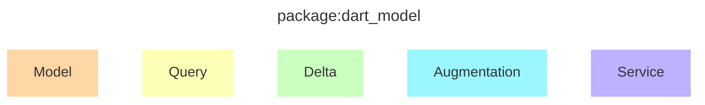
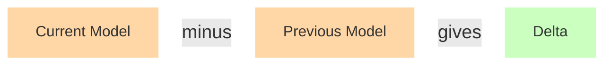
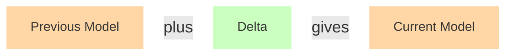

# Dart Model

Author: David Morgan

Status: **Work In Progress**

## Introduction

A package for describing Dart code, augmentations to it, and queries about it.

Motivated by its use in the
[macros feature](https://github.com/dart-lang/language/blob/main/working/macros/feature-specification.md)
but not tied to it.

## Concepts



### Data Types

`Model`, `Query`, `Delta` and `Augmentation` are serializable data types, see details [below](#serialization-and-schema).

### Model

A description of a corpus of Dart code with the following properties:

- It is a **partial** model.
  - It can omit files, parts of files, and attributes of parts of files, depending on what was requested, what was known about the corpus when the request was made, and considerations about what a particular viewer of the code is _allowed_ to see.
- It is **sufficient input for codegen or macros**.
  - Anything that is needed to know what to generate, for example type hierarchies, is modeled.

```mermaid
flowchart LR
  Model:::model --> Generator:::generator --> Augmentation:::augmentation

  classDef model fill:#ffd6a5,stroke-width:0px
  classDef generator fill:#fff,stroke:#000
  classDef augmentation fill:#9bf6ff,stroke-width:0px
  ```

### Query

A query for information about a corpus of Dart code with the following properties:

- It **can be applied to a `Model`** to extract another, smaller or identical, `Model`.
  - For example a `Query` for a particular package URI extracts the part of the `Model` corresponding to that URI.
- It is **designed for codegen or macros** in the sense that it should be possible in just one or a small number of queries to obtain all the information a particular generation needs.
  - An example `Query` might read in pseudocode: give me class `Foo`, its public fields, then all types mentioned in those field types and their metadata.

```mermaid
flowchart LR
  Model:::model --> Query:::query --> m2[Smaller Model]:::model


  classDef model fill:#ffd6a5,stroke-width:0px
  classDef query fill:#fdffb6,stroke-width:0px
```

### Delta

The delta between two `Model` instances.

- Given `Model` instances `previous` and `current`, the `Delta` can be computed.
  - Then: applying the `Delta` to `previous` makes it equal to `current`.




### Augmentation

The output of a generator or macro: a set of incremental changes that can be applied to a program, with the following properties:

- It is **designed for the generator and the host** in the sense that it is both convenient to build and convenient to apply; for example, declarations and definitions might be separated out as they have different types of consequences when applied to a program.

### Service

An endpoint that can accept a `Query` instance and return a `Model`.

`package:dart_model` provides a reference `Service` implementation that is backed by a `Model`. More interesting `Service` implementations for generators and macros will be backed by the analyzer or the CFE.

## Serialization and Schema

`Model`, `Query`, `Delta` and `Augmentation` are each described by a JSON schema published in the same package, as a plain text file and also embedded in Dart code for use by tools.

Each schema is available in two versions: a "strict" schema that only matches what the current package produces, and a "loose" schema that allows for future changes.

Schemas are versioned using semver. Schemas are updated in place for compatible changes, and as new files for major version (incompatible) releases.

## Performance

Data types can be serialized to and from JSON per their schemas.

A binary serialization format is available for performance. When this is used, values are accumulated directly into a binary buffer, so there is no "serialize" step. The received of the value can use values directly from the buffer, so there is no "deserialize" step.

## Macro <-> Host Communication

`package:dart_model` types can be embedded in communication between macro and host, but a higher level protocol on top that is out of scope here.
